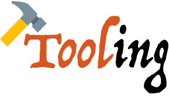

<p align="center">
	
</p>

<p align="center">
	<a href="https://www.npmjs.com/package/tooling"></a>
	<a href="https://www.npmjs.com/package/tooling"></a>
	<a href="https://travis-ci.org/egoist/tooling"></a>
</p>

<p align="center">
	<a href="https://gitter.im/egoist/tooling?utm_source=badge&amp;utm_medium=badge&amp;utm_campaign=pr-badge&amp;utm_content=badge"></a>
	<a href="" target="_blank"></a>
	<a href="https://github.com/semantic-release/semantic-release"></a>
</p>

## Technologies

What `tooling` supports (which means you don't have to install these dependencies yourself):

- Webpack
- Babel 6 + Stage-0 + Runtime
- React with JSX
- Vue
- Vue-loader
- PostCSS with PreCSS
- Autoprefixer
- Hot reloading
- BrowserSync
- Custom HTML template
- Build or Watch
- Long-term caching

Real world example, run `npm start` in [this repo](https://github.com/egoist/how-often) or [try it out](/try-it-out.md) 👉

## Usage

Installing `tooling` via NPM is easy (**WARN: only support node >=5**):

```bash
npm install tooling -g
```

Build a project in production mode:

```bash
# default entry is ./src/index
# in this case we use Vue in our app
tooling build --entry [entry]

# multi entry support
--entry example # => example[.ext] or example/index[.ext]
--entry app.js,app.css # => ['app.js', 'app.css']
--entry js:app.js,css:app.css # => {js: 'app.js', css: 'app.css'}
```

Run dev server with hot reloading:

```bash
# default entry is ./src/index
# in this case we use React in our app
tooling watch --entry [entry] --use react
```

Options:

|Argument|Description|
|---|---|
|-e/--entry|Set webpack entry, support multi entries|
|-p/--port|devServer port, available in watch mode|
|--bs/--browser-sync|Enable browserSync at port 23789 or a custom port|
|-s/--silent|Do not open browser window when running devServer|
|-u/--use|Set the framework you use, eg: `react`, `vue`. `vue` by default|
|--ai/--auto-install|(**Buggy**) Automatically install missing dependencies when editing|
|--title|Set html title|

**Set up custom index.html in `package.json`**. see usage at [html-webpack-plugin](https://github.com/ampedandwired/html-webpack-plugin)

```
{
	"name": "My tooling app",
	"tooling": {
	    "index": {
	      "title": "tooling index",
	      "template": "src/index.template"
	    }
	}
}
```

For advanced usage: [Wiki](https://github.com/egoist/tooling/wiki)

## API

**WIP.**

```bash
npm install tooling --save
```

```javascript
import tooling from 'tooling'

/**
 * Tooling
 *
 * @param {string} type - 'watch' or 'build'
 * @param {object} options - options for webpack,
 * 					    - override the default settings.
 *				 options.port - available in 'watch' mode
 *							  - to set the port devServer should run at
 */
tooling(type, options)
```

## License

MIT © [EGOIST](https://github.com/egoist)
